# Retra

スクラムチームのためのリアルタイム・レトロスペクティブボード

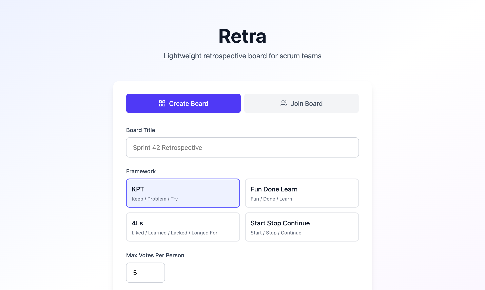

## 主要機能

- **4種類のフレームワーク** - KPT / Fun Done Learn / 4Ls / Start Stop Continue
- **5段階のフェーズワークフロー** - 記入 → 投票 → 議論 → アクション → 完了
- **フェーズ遷移確認ダイアログ** - フェーズ移行時の確認ダイアログで誤操作を防止
- **リアクション機能** - カードへの絵文字リアクション（👍❤️😂🎉🤔👀）
- **メモ機能** - 議論・アクションフェーズでカードにメモを追加
- **アクションアイテム追跡** - アクションフェーズでアクションアイテムを作成・管理（担当者・期限・優先度・ステータス）
- **レトロ履歴ダッシュボード** - 過去のレトロスペクティブの履歴閲覧・エンゲージメント指標のトレンド分析
- **ドラッグ&ドロップ** - カードの並べ替え・カラム間移動
- **リアルタイム同期** - WebSocket（STOMP）による即時反映
- **タイマー機能** - フェーズごとの時間管理（開始・一時停止・リセット）
- **投票機能** - 1人あたりの最大投票数を設定可能、投票進捗バーで残り投票数を可視化
- **議論済みマーク** - ファシリテーターがカードに議論済みマークを付けてグレーアウト・ソート
- **フェーズベースのアクセス制御** - 記入フェーズでのみカード作成、投票フェーズでのみ投票など
- **匿名モード** - ボード作成時に設定可能、カードの投稿者名を他の参加者から非表示
- **エクスポート機能** - ボード内容をCSVまたはMarkdown形式でダウンロード
- **アクションアイテム引き継ぎ** - 同一チームの前回レトロから未完了アクションアイテムを引き継ぎ
- **自動スナップショット** - ボード完了時に自動でスナップショットを保存
- **複数人参加** - URLを共有するだけでボードに参加可能

## 技術スタック

| レイヤー | 技術 |
|---------|------|
| バックエンド | Spring Boot 3.4 + Kotlin 2.0 |
| フロントエンド | React 19 + TypeScript + Vite 7 + Zustand + TailwindCSS v4 |
| データベース | SQLite（Flyway マイグレーション） |
| リアルタイム通信 | WebSocket（STOMP プロトコル） |
| グラフ描画 | Recharts |

## セットアップ・実行方法

### 前提条件

- Java 21（Amazon Corretto 推奨）
- Node.js 20+

### 開発環境

バックエンドとフロントエンドを同時に起動します。

```bash
# バックエンド（ポート 8080）
cd backend && ./gradlew bootRun

# フロントエンド（ポート 5173、/api と /ws をバックエンドにプロキシ）
cd frontend && npm run dev
```

### 本番ビルド

```bash
cd frontend && npm run build
cd ../backend && ./gradlew copyFrontend && ./gradlew build
java -jar backend/build/libs/retra-0.0.1-SNAPSHOT.jar
```

### テスト・リント

```bash
# バックエンドテスト（JUnit 5 + MockK/Mockito）
cd backend && ./gradlew test

# フロントエンドテスト（Vitest + Testing Library）
cd frontend && npm run test

# フロントエンドテスト（カバレッジレポート）
cd frontend && npm run test:coverage

# E2E テスト（Playwright）
cd frontend && npm run test:e2e

# フロントエンドリント
cd frontend && npm run lint

# TypeScript 型チェック
cd frontend && npx tsc --noEmit
```

## スクリーンショット

<details>
<summary>全スクリーンショットを表示</summary>

### ホームページ - ボード作成
フレームワークの選択、チーム名、最大投票数、匿名モードなどを設定してボードを作成。


### ホームページ - ボード参加
既存ボードのスラッグを入力して参加。


### ボード参加タブ
URLを共有してボードに参加する画面。

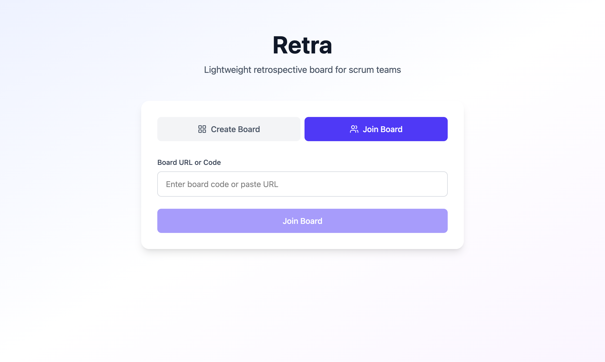

### ボード作成直後（ニックネーム入力）
ボード作成後、ニックネーム入力モーダルが表示される。

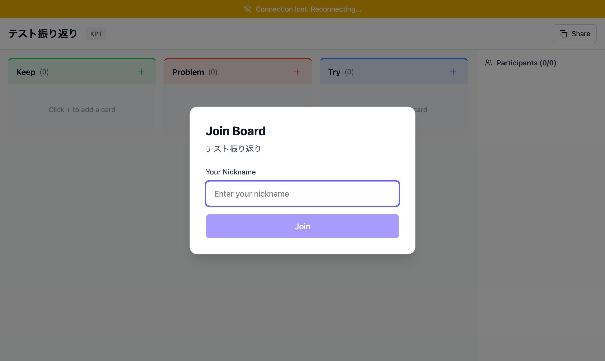

### 参加者のボード画面
URLを共有して別の参加者がボードに参加した状態。

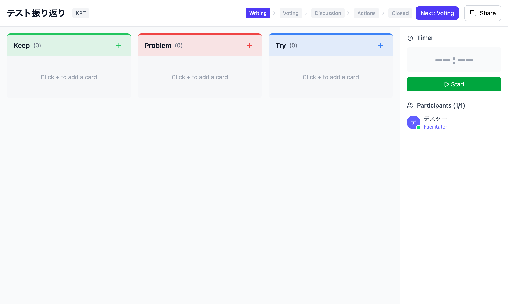

### 記入フェーズ - カード追加
各カラムにカードを追加した状態。カードには投稿者名が表示される。

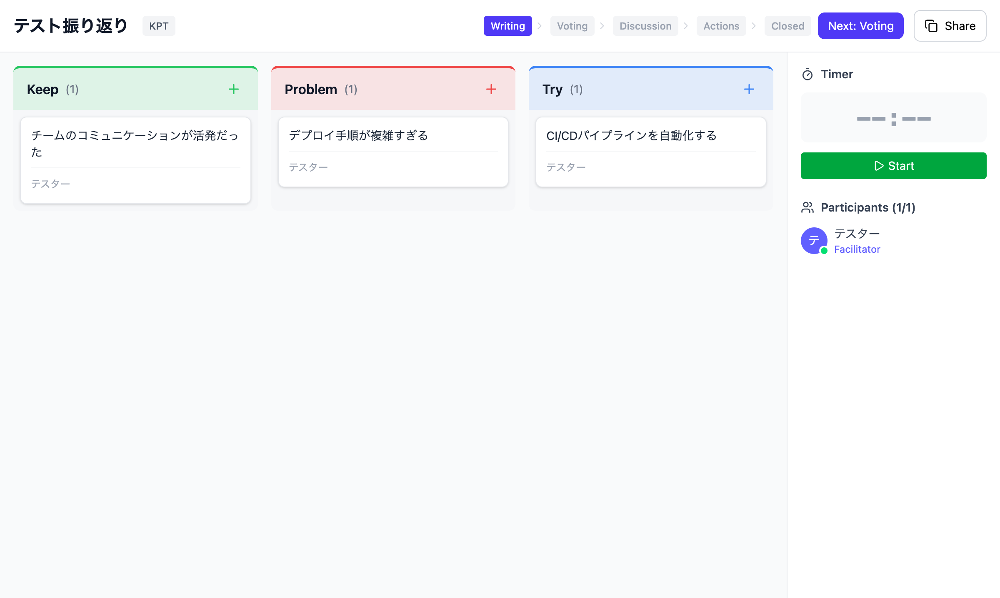

### 記入フェーズ - 複数参加者
複数の参加者がそれぞれカードを追加した状態。

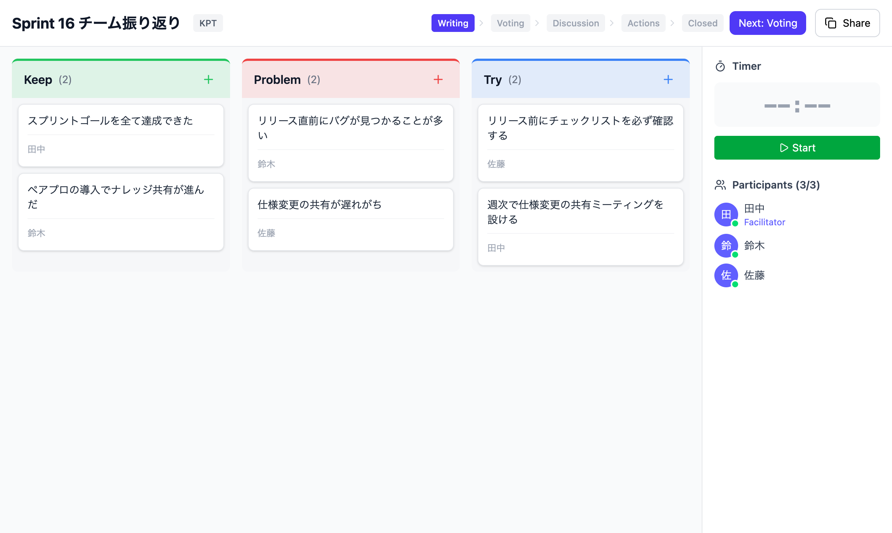

### 投票フェーズ
投票フェーズに移行した状態。各カードに投票ボタンと投票進捗バーが表示される。

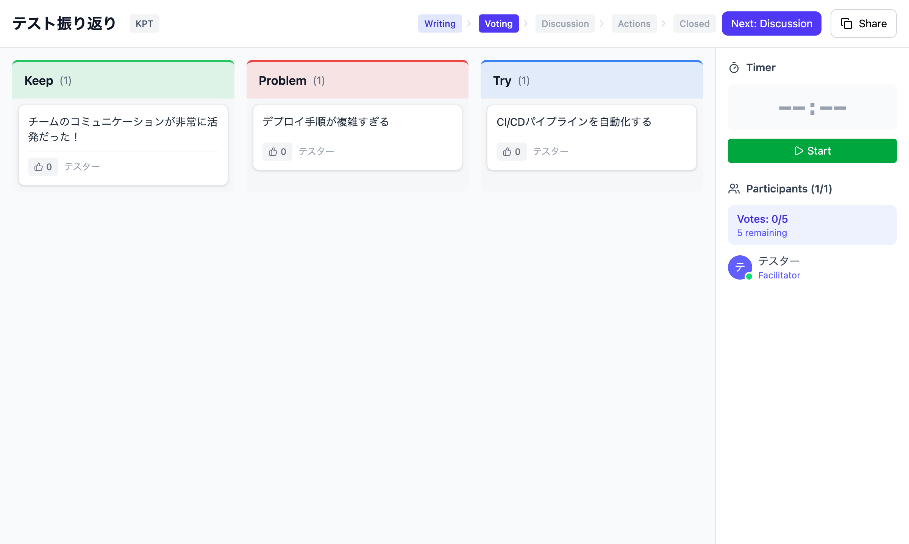

### 投票フェーズ - 投票済み
参加者が投票を行った後の状態。投票数が表示される。

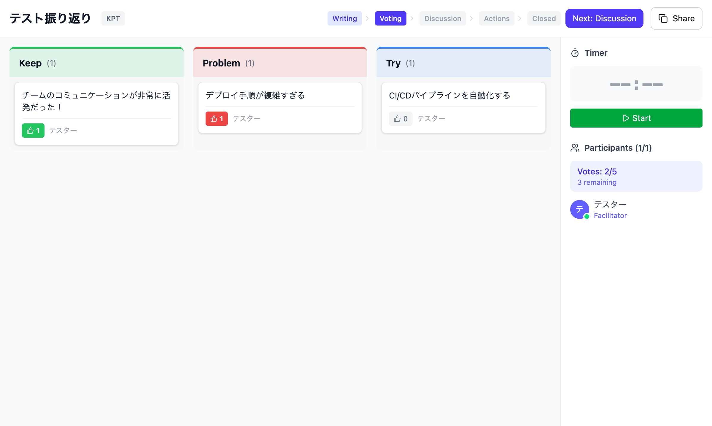

### 投票フェーズ - 複数参加者の結果
複数参加者が投票した後の集計結果。

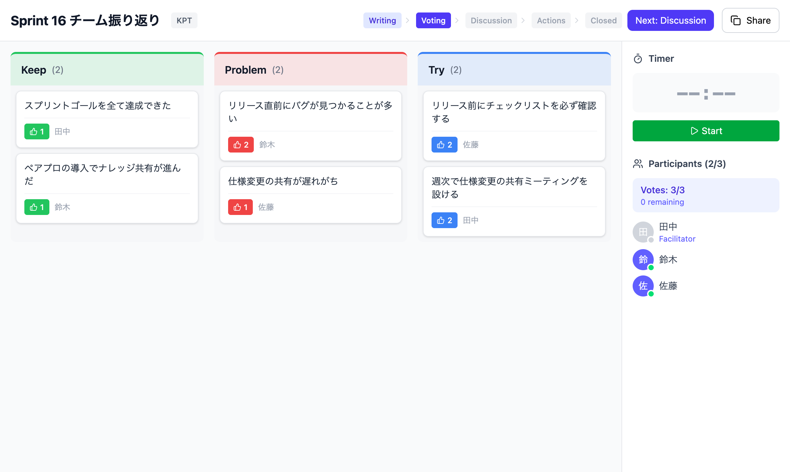

### 投票上限
1人あたりの最大投票数に達した状態。

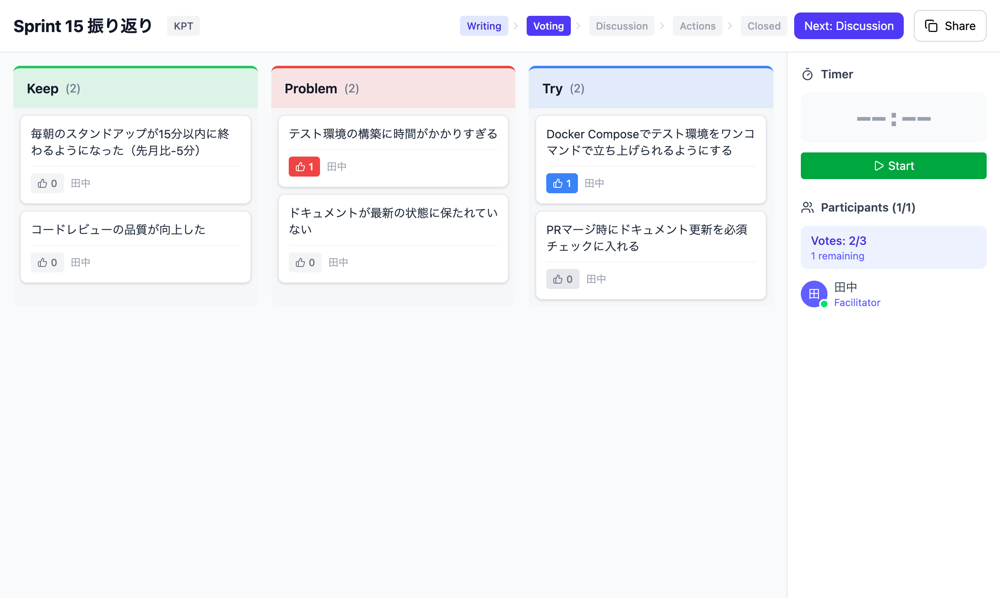

### 議論フェーズ
投票結果を参考に議論を進めるフェーズ。議論済みマーク機能でカードをグレーアウトできる。

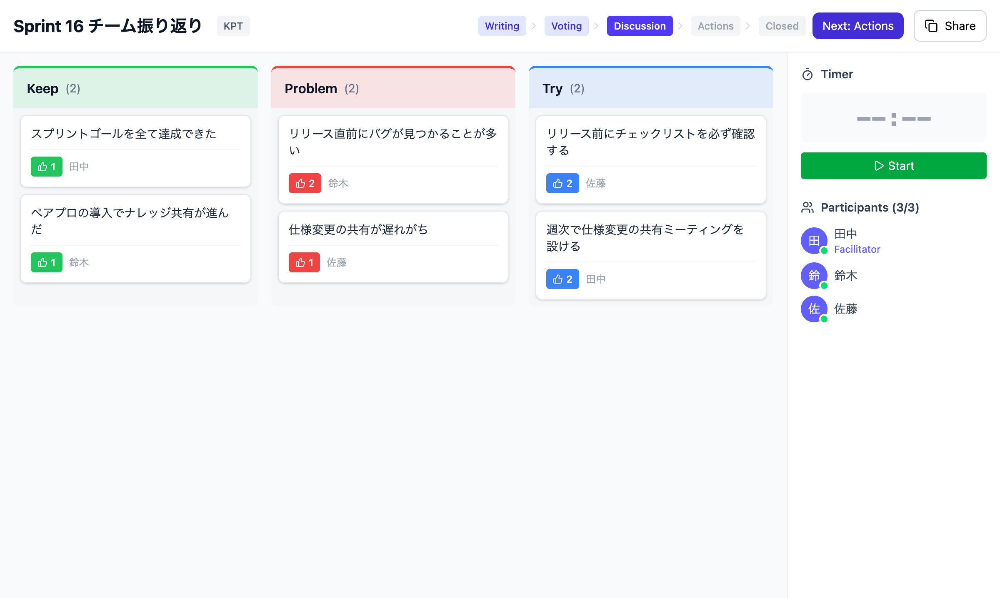

### アクションアイテムフェーズ
議論を踏まえてアクションアイテムを整理するフェーズ。担当者・期限・優先度を設定してアクションアイテムを作成できる。

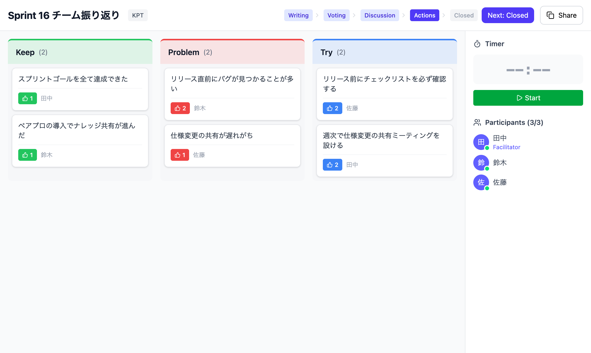

### 完了フェーズ
レトロスペクティブが完了した状態。ボードのスナップショットが自動保存される。

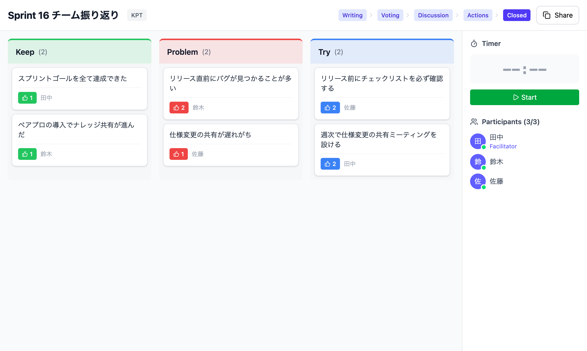

### 404 ページ
存在しないボードにアクセスした場合のエラーページ。

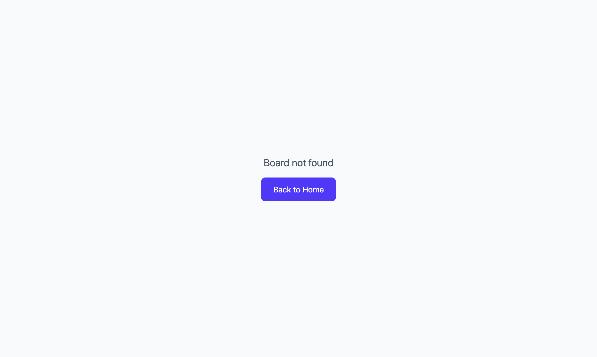

</details>

## アーキテクチャ

### イベント駆動リアルタイム更新

```
REST API → UseCase（DB永続化）→ Spring ApplicationEvent
  → DomainEventBroadcaster（@EventListener）→ STOMP broadcast
    → /topic/board/{slug}/{category}
      → フロントエンド Zustand Store 更新
```

### ディレクトリ構成

```
backend/src/main/kotlin/com/retra/
├── config/              # SPA fallback, CORS, WebSocket設定
├── shared/
│   ├── domain/          # DomainException, DomainEvent
│   └── gateway/         # イベント発行, 例外ハンドラ, STOMP ブロードキャスト
├── board/
│   ├── domain/          # Board, Participant, Framework, Phase
│   ├── usecase/         # ボード作成・取得・フェーズ遷移・参加・エクスポート
│   └── gateway/         # REST コントローラ, JPA リポジトリ, WebSocket
├── card/
│   ├── domain/          # Card, Vote, Memo, Reaction
│   ├── usecase/         # カード・投票・メモ・リアクション操作
│   └── gateway/         # REST コントローラ, JPA リポジトリ
├── timer/
│   ├── usecase/         # タイマーサービス
│   └── gateway/         # REST コントローラ
├── actionitem/
│   ├── domain/          # ActionItem, ActionItemStatus
│   ├── usecase/         # アクションアイテムCRUD・ステータス変更
│   └── gateway/         # REST コントローラ, JPA リポジトリ
└── history/
    ├── domain/          # BoardSnapshot
    ├── usecase/         # スナップショット作成・取得・トレンド分析
    └── gateway/         # REST コントローラ, JPA リポジトリ

frontend/src/
├── api/                 # REST API クライアント
├── pages/               # ページコンポーネント（5ページ）
├── components/          # UI コンポーネント（29）
├── store/               # Zustand ストア
├── websocket/           # STOMP クライアント
├── hooks/               # カスタムフック
├── test/                # テストユーティリティ・フィクスチャ
├── types/               # TypeScript 型定義
└── utils/               # ユーティリティ (エクスポート変換等)
```

## API エンドポイント

すべてのエンドポイントは `/api/v1` 配下です。

### ボード

| メソッド | パス | 説明 |
|---------|------|------|
| `POST` | `/boards` | ボード作成 |
| `GET` | `/boards/{slug}` | ボード取得 |
| `PATCH` | `/boards/{slug}/phase` | フェーズ遷移（ファシリテーターのみ） |
| `POST` | `/boards/{slug}/participants` | ボード参加 |

### カード

| メソッド | パス | 説明 |
|---------|------|------|
| `POST` | `/boards/{slug}/cards` | カード作成（記入フェーズのみ） |
| `PUT` | `/boards/{slug}/cards/{id}` | カード更新（投稿者のみ） |
| `DELETE` | `/boards/{slug}/cards/{id}` | カード削除（投稿者またはファシリテーター） |
| `PATCH` | `/boards/{slug}/cards/{id}/move` | カード移動（ドラッグ&ドロップ） |
| `PATCH` | `/boards/{slug}/cards/{id}/discussed` | 議論済みマーク切替（ファシリテーターのみ） |

### 投票

| メソッド | パス | 説明 |
|---------|------|------|
| `POST` | `/boards/{slug}/votes` | 投票（投票フェーズのみ） |
| `DELETE` | `/boards/{slug}/votes` | 投票取消（投票フェーズのみ） |
| `GET` | `/boards/{slug}/votes/remaining` | 残り投票数取得 |

### メモ

| メソッド | パス | 説明 |
|---------|------|------|
| `POST` | `/boards/{slug}/cards/{cardId}/memos` | メモ作成 |
| `PUT` | `/boards/{slug}/cards/{cardId}/memos/{memoId}` | メモ更新 |
| `DELETE` | `/boards/{slug}/cards/{cardId}/memos/{memoId}` | メモ削除 |

### リアクション

| メソッド | パス | 説明 |
|---------|------|------|
| `POST` | `/boards/{slug}/reactions` | リアクション追加 |
| `DELETE` | `/boards/{slug}/reactions` | リアクション削除 |

### タイマー

| メソッド | パス | 説明 |
|---------|------|------|
| `POST` | `/boards/{slug}/timer` | タイマー操作（ファシリテーターのみ） |
| `GET` | `/boards/{slug}/timer` | タイマー状態取得 |

### エクスポート

| メソッド | パス | 説明 |
|---------|------|------|
| `GET` | `/boards/{slug}/export` | ボードエクスポート（CSV/Markdown） |

### アクションアイテム

| メソッド | パス | 説明 |
|---------|------|------|
| `GET` | `/boards/{slug}/action-items` | アクションアイテム一覧取得 |
| `POST` | `/boards/{slug}/action-items` | アクションアイテム作成（アクションフェーズのみ） |
| `PUT` | `/boards/{slug}/action-items/{id}` | アクションアイテム更新 |
| `PATCH` | `/boards/{slug}/action-items/{id}/status` | アクションアイテムステータス変更 |
| `DELETE` | `/boards/{slug}/action-items/{id}` | アクションアイテム削除 |

### アクションアイテム引き継ぎ

| メソッド | パス | 説明 |
|---------|------|------|
| `GET` | `/boards/{slug}/carry-over-items` | 前回レトロの引き継ぎアクションアイテム取得 |
| `PATCH` | `/boards/{slug}/carry-over-items/{actionItemId}/status` | 引き継ぎアイテムステータス更新（ファシリテーターのみ） |

### 履歴・ダッシュボード

| メソッド | パス | 説明 |
|---------|------|------|
| `GET` | `/history` | レトロ履歴一覧（`teamName` でフィルタ可能） |
| `GET` | `/history/{snapshotId}` | スナップショット詳細取得 |
| `GET` | `/history/trends` | トレンドデータ取得（`teamName` でフィルタ可能） |
