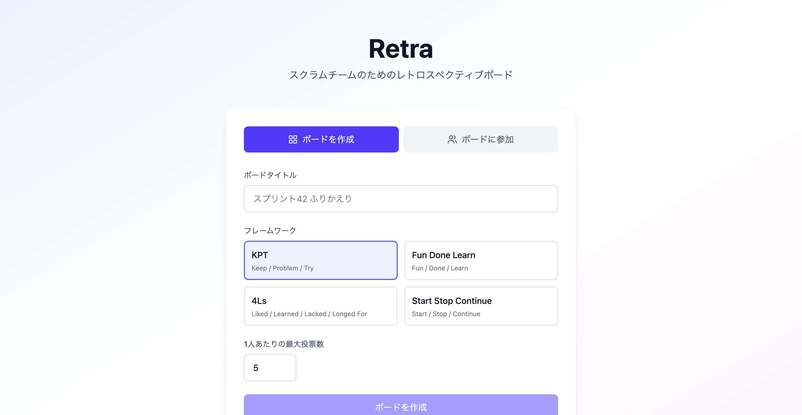
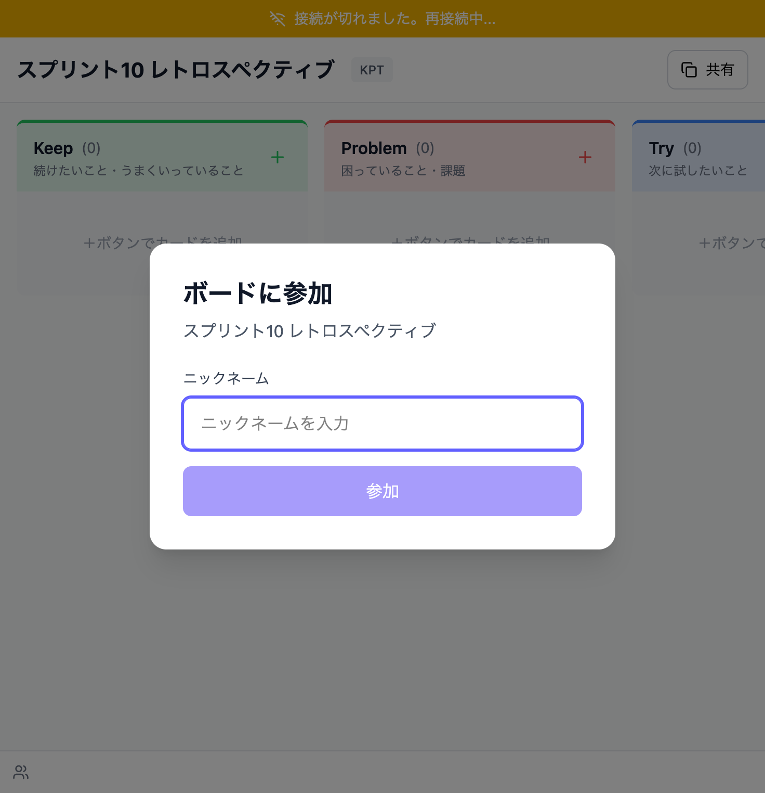
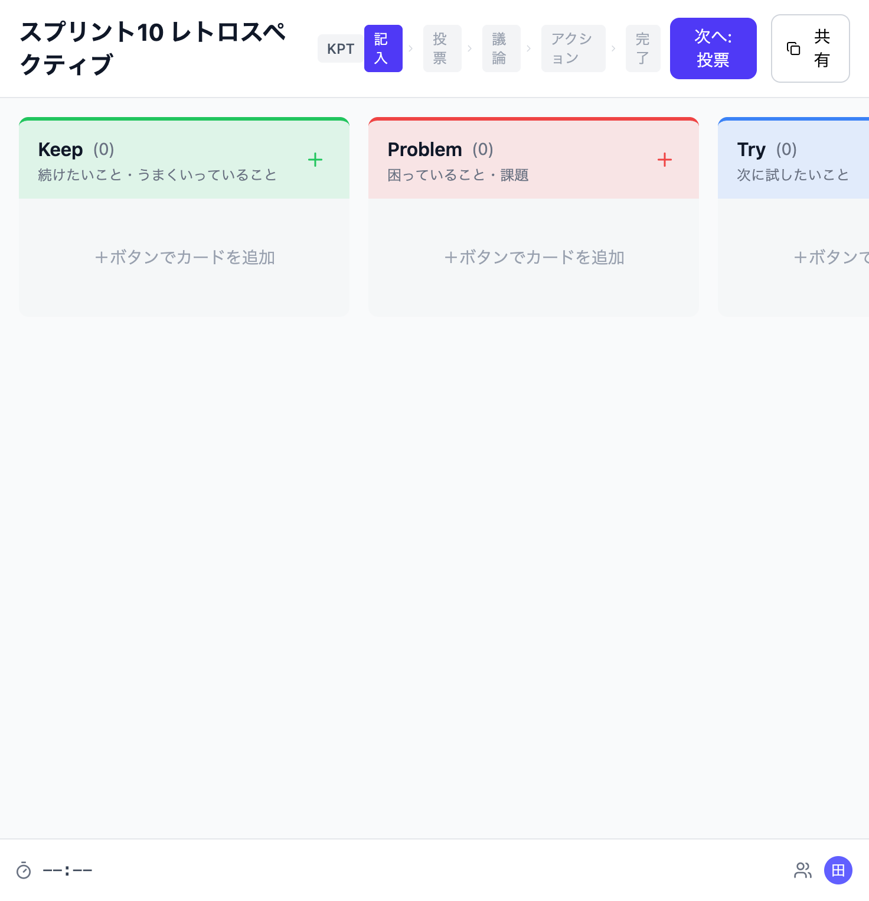
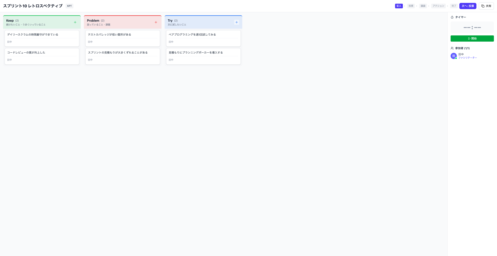
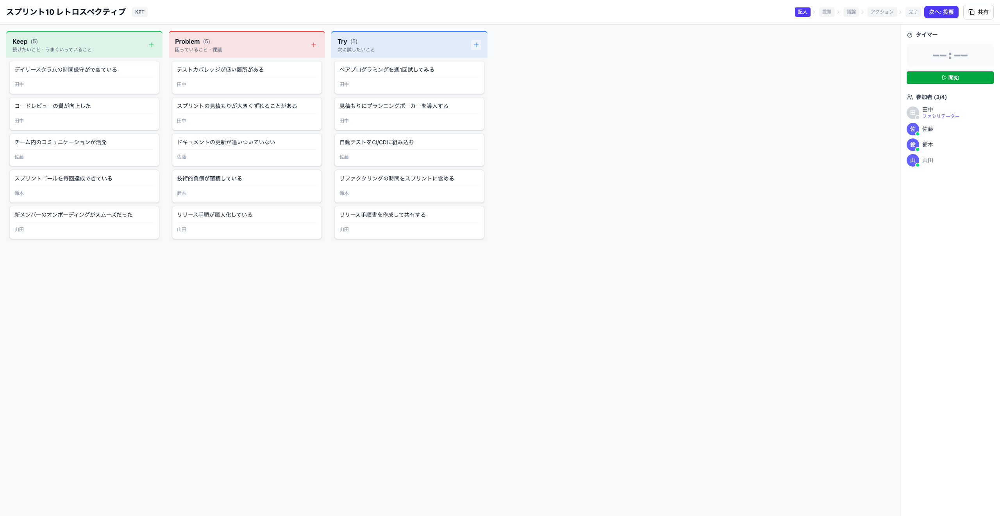
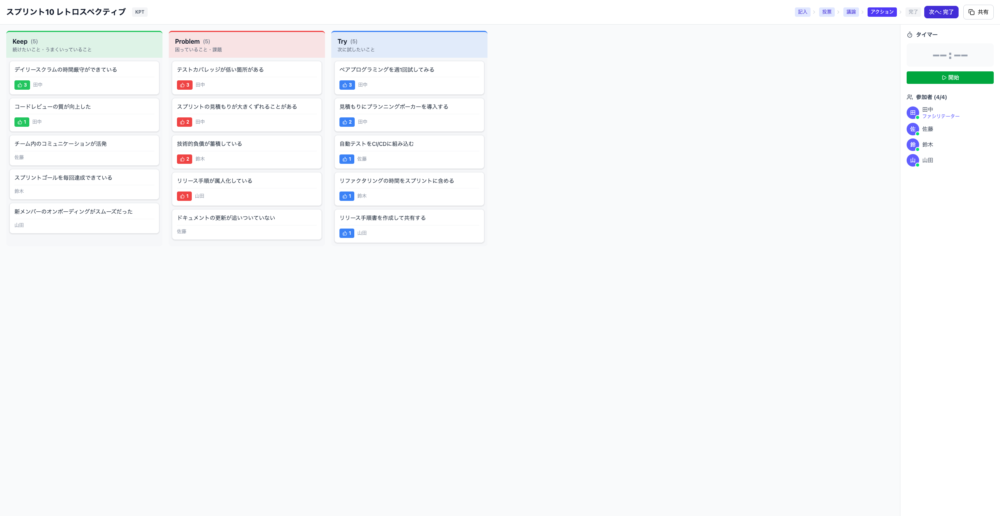
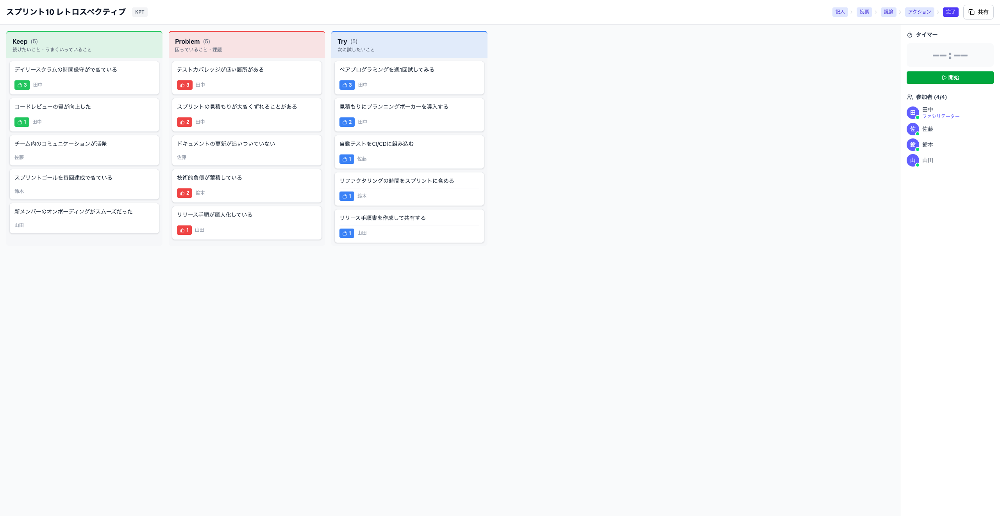
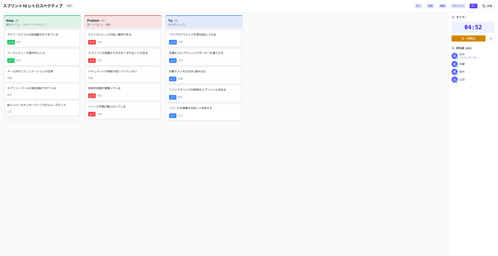

# Retra

スクラムチームのためのリアルタイム・レトロスペクティブボード



## 主要機能

- **4種類のフレームワーク** - KPT / Fun Done Learn / 4Ls / Start Stop Continue
- **5段階のフェーズワークフロー** - 記入 → 投票 → 議論 → アクション → 完了
- **リアルタイム同期** - WebSocket（STOMP）による即時反映
- **タイマー機能** - フェーズごとの時間管理（開始・一時停止・リセット）
- **投票機能** - 1人あたりの最大投票数を設定可能
- **フェーズベースのアクセス制御** - 記入フェーズでのみカード作成、投票フェーズでのみ投票など
- **複数人参加** - URLを共有するだけでボードに参加可能

## 技術スタック

| レイヤー | 技術 |
|---------|------|
| バックエンド | Spring Boot 3.4 + Kotlin 2.0 |
| フロントエンド | React 19 + TypeScript + Vite 7 + Zustand + TailwindCSS v4 |
| データベース | SQLite（Flyway マイグレーション） |
| リアルタイム通信 | WebSocket（STOMP プロトコル） |

## セットアップ・実行方法

### 前提条件

- Java 21（Amazon Corretto 推奨）
- Node.js 18+

### 開発環境

バックエンドとフロントエンドを同時に起動します。

```bash
# バックエンド（ポート 8080）
cd backend && ./gradlew bootRun

# フロントエンド（ポート 5173、/api と /ws をバックエンドにプロキシ）
cd frontend && npm run dev
```

### 本番ビルド

```bash
cd frontend && npm run build
cd ../backend && ./gradlew copyFrontend && ./gradlew build
java -jar backend/build/libs/retra-0.0.1-SNAPSHOT.jar
```

### テスト・リント

```bash
# バックエンドテスト
cd backend && ./gradlew test

# フロントエンドリント
cd frontend && npm run lint

# TypeScript 型チェック
cd frontend && npx tsc --noEmit
```

## スクリーンショット

<details>
<summary>全スクリーンショットを表示</summary>

### ホームページ
ボードの作成・参加ができるトップページ。フレームワークの選択や最大投票数の設定が可能。


### ボード作成直後
ボード作成後、ファシリテーターとしてボードに参加した状態。



### 参加者のボード画面
URLを共有して別の参加者がボードに参加した状態。



### 記入フェーズ - カード追加
各カラムにカードを追加した状態。カードには投稿者名が表示される。



### 全参加者のカード
複数の参加者がそれぞれカードを追加した状態。



### 投票フェーズ
投票フェーズに移行した状態。各カードに投票ボタンが表示される。


### 投票結果
参加者が投票を行った後の状態。投票数が表示される。


### 議論フェーズ
議論フェーズに移行した状態。投票結果を参考に議論を進める。


### アクションアイテムフェーズ
議論を踏まえてアクションアイテムを整理するフェーズ。



### 完了フェーズ
レトロスペクティブが完了した状態。



### タイマー（実行中）
フェーズごとの時間管理用タイマー。ファシリテーターが操作可能。



### タイマー（一時停止）
タイマーを一時停止した状態。


</details>

## アーキテクチャ

### イベント駆動リアルタイム更新

```
REST API → Service（DB永続化）→ Spring ApplicationEvent
  → BoardEventBroadcaster（@EventListener）→ STOMP broadcast
    → /topic/board/{slug}/{category}
      → フロントエンド Zustand Store 更新
```

### ディレクトリ構成

```
backend/src/main/kotlin/com/retra/
├── config/          # SPA fallback, CORS, WebSocket設定
├── controller/      # REST エンドポイント
├── domain/
│   ├── model/       # JPA エンティティ
│   └── repository/  # Spring Data JPA リポジトリ
├── dto/             # リクエスト/レスポンス DTO
├── service/         # ビジネスロジック（フェーズベースアクセス制御）
├── websocket/       # STOMP ブロードキャスト
└── exception/       # 例外ハンドラ

frontend/src/
├── api/             # REST API クライアント
├── pages/           # ページコンポーネント
├── components/      # UI コンポーネント
├── store/           # Zustand ストア
├── websocket/       # STOMP クライアント
└── types/           # TypeScript 型定義
```

## API エンドポイント

すべてのエンドポイントは `/api/v1` 配下です。

| メソッド | パス | 説明 |
|---------|------|------|
| `POST` | `/boards` | ボード作成 |
| `GET` | `/boards/{slug}` | ボード取得 |
| `PATCH` | `/boards/{slug}/phase` | フェーズ遷移（ファシリテーターのみ） |
| `POST` | `/boards/{slug}/cards` | カード作成（記入フェーズのみ） |
| `PUT` | `/boards/{slug}/cards/{id}` | カード更新（投稿者のみ） |
| `DELETE` | `/boards/{slug}/cards/{id}` | カード削除（投稿者またはファシリテーター） |
| `POST` | `/boards/{slug}/votes` | 投票（投票フェーズのみ） |
| `DELETE` | `/boards/{slug}/votes/{id}` | 投票取消（投票フェーズのみ） |
| `POST` | `/boards/{slug}/timer` | タイマー操作（ファシリテーターのみ） |
| `POST` | `/boards/{slug}/participants` | ボード参加 |
